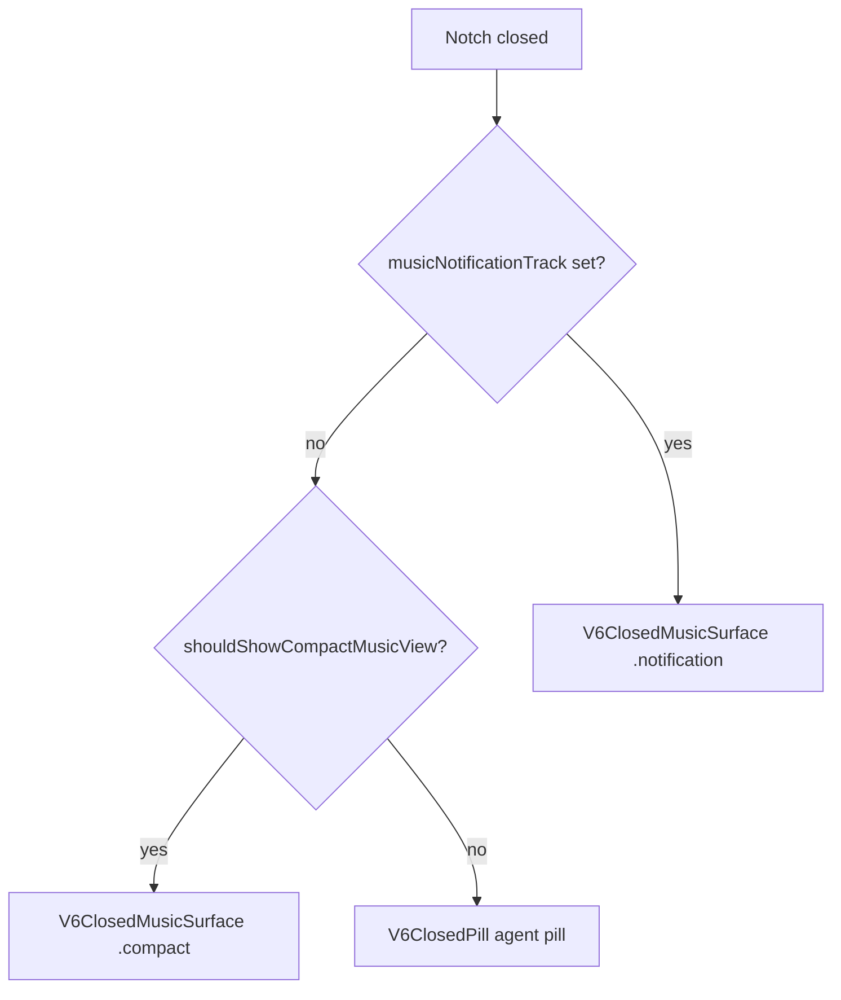

# AGENTS

This file defines the working agreement for the coding agent in this repository.

## Project

**NotchTune** is the product name for this repo — a native macOS notch / top-bar companion for music (Spotify, Apple Music) and terminal-native AI agents. See [README.md](README.md) for highlights, supported integrations, install, and dev commands.

Swift package targets still use legacy `OpenIsland*` names (`OpenIslandApp`, `OpenIslandCore`, `OpenIslandHooks`, `OpenIslandSetup`). Use **NotchTune** in user-facing copy and docs; use the Swift target names when building or editing code.

## Goal

Keep all work incremental, reviewable, and reversible. Every meaningful round of changes must end with a Git commit so commits become the control surface for progress, rollback, and review.

## Required Workflow

1. Start each round by checking the current repository state with `git status -sb`.
2. Enter a topic worktree on a feature branch before editing. Do not edit files directly in the shared `main` worktree.
3. Read the relevant files before editing. Do not guess repository structure or behavior.
4. Keep each round focused on a single coherent change.
5. After making changes, run the most relevant verification available for that round.
6. Summarize what changed, including any verification gaps.
7. Commit the round on the feature branch before stopping.

## Commit Policy

- Every round that modifies files must end with a commit.
- Do not batch unrelated changes into one commit.
- Use clear conventional-style commit messages such as `feat:`, `fix:`, `refactor:`, `docs:`, or `chore:`.
- Do not amend existing commits unless explicitly requested.
- Create a feature branch for every independent change. Do not commit directly to `main`.
- Push feature branches and open PRs when the user asks for remote review or integration.
- When the user asks to open or submit a PR, open a normal ready-for-review PR by default. Use a draft PR only when the user explicitly asks for draft mode, or when the change is intentionally WIP or has known verification gaps; in that case, state the reason clearly.
- Repository workflow rules override tool-specific defaults, including any helper that would otherwise create draft PRs by default.

## Safety Rules

- Never revert or overwrite user changes unless explicitly requested.
- If unexpected changes appear, inspect them and work around them when possible.
- If a conflict makes the task ambiguous or risky, stop and ask before proceeding.
- Never use destructive Git commands such as `git reset --hard` without explicit approval.

## Engineering Rules

- Prefer small end-to-end slices over large speculative scaffolding.
- Preserve a clean working tree after each round.
- Add documentation when making architectural or workflow decisions.
- Prefer native macOS and Swift-friendly project structure for this repository.

## Branching And Worktree Rules

- Treat the primary `NotchTune` checkout on `main` (e.g. `/Users/davidlam/Developer/NotchTune`) as the shared integration worktree.
- Never edit, commit, or push directly on `main`. All changes must go through a feature branch and PR before integration.
- Use the shared `main` worktree only to inspect repository state, fetch, update with `git pull --ff-only`, and run final verification after PRs merge.
- Create one worktree per branch and one branch per worktree. Never attach two worktrees to the same branch.
- Create new worktrees from `origin/main`, not from a locally drifted feature branch.
- Use sibling worktree paths named like `NotchTune-<topic>` next to the main checkout.
- Use branch names that match the workstream, such as `feat/<topic>`, `fix/<topic>`, `docs/<topic>`, or `investigate/<topic>`.
- Keep each worktree focused on one coherent slice with a narrow file ownership area when possible.
- Rebase or merge the latest `origin/main` into the feature branch before integrating it back.
- Integrate completed work through a PR targeting `main`, then update the shared `main` worktree with `git pull --ff-only`.
- PRs are ready-for-review by default unless explicitly requested as draft or clearly marked WIP.
- Remove merged worktrees and delete merged branches after the integration round is complete.
- If multiple agents are working in parallel, assign each agent its own worktree instead of sharing one checkout.
- All PRs must target `main`. Do not chain PRs through another feature branch unless the user explicitly requests that structure.

See [docs/worktree-workflow.md](docs/worktree-workflow.md) for the concrete commands and lifecycle.

## Product Boundaries

- Keep product scope in `docs/product.md`. Do not duplicate the supported agent, terminal, or IDE matrix here.
- Do not broaden supported tools, runtimes, platforms, or environments unless the user explicitly asks.
- Keep hook behavior aligned with `docs/hooks.md` and the implementation in `Sources/OpenIslandCore`.

## Integration Guardrails

- Treat `Codex CLI` and `Codex Desktop App` as distinct runtime surfaces.
- Do not assume Codex file edits are covered by `PreToolUse`; Codex may edit through internal apply-patch paths.
- Keep managed Codex CLI hooks low-noise unless the user explicitly asks for richer hook coverage.
- Keep Claude-family integrations source-specific in user-facing behavior, even when payload formats are shared.
- Treat Gemini hooks as fire-and-forget unless the code being edited explicitly supports blocking behavior.

## App Targets And Naming

- **Product / release app:** `NotchTune.app` (see [README.md](README.md) for install and distribution).
- **Dev bundle:** `~/Applications/NotchTune Dev.app` — local wrapper around the repo-built `OpenIslandApp` binary, not a separate product line.
- **Canonical runtime target:** `OpenIslandApp` (`swift run OpenIslandApp`, Xcode app target, or `zsh scripts/launch-dev-app.sh`).
- Use `NotchTune Dev.app` for manual verification when bundle semantics, LaunchServices, or installed-hook behavior matter.
- When the user asks to launch or restart NotchTune, refresh the dev bundle first with `zsh scripts/launch-dev-app.sh` instead of only running `open -na`. Opening the bundle alone can relaunch a stale binary.
- For work that touches Accessibility, Automation, precision jump, or other macOS TCC-sensitive behavior, run `zsh scripts/setup-dev-signing.sh` once before repeated manual verification so the dev bundle keeps a stable local signing identity.
- Use `scripts/harness.sh smoke` or `scripts/smoke-dev-app.sh` only for deterministic harness runs; those commands intentionally launch the repo executable directly rather than the installed dev bundle.
- Hook helpers ship as `OpenIslandHooks` and `OpenIslandSetup`; the dev bundle copies them into `Contents/Helpers/`.

## Verification

- Run targeted checks that match the change.
- If no automated verification exists yet, state that explicitly in the final summary and still commit the change.

## Default Expectation

Unless the user says otherwise, the agent should finish each completed round in this order:

1. implement
2. verify
3. summarize
4. commit

## NotchTune UI Memory

Reference for agents working on NotchTune's notch / island / music UI (see [README.md](README.md) — *Dynamic notch switching*, *Music controls*, *Agent monitoring*). Implementation lives in the `OpenIslandApp` target; state flows through `AppModel` → `OverlayUICoordinator` → `IslandPanelView`.

### Notch states

| State | Meaning | Window |
|-------|---------|--------|
| `closed` | Compact pill at top of screen | Fixed opened-size panel; SwiftUI morphs shape/content |
| `opened` | Expanded NotchTune surface (Agents or Music tab) | Same panel, interactive |
| `popping` | Brief scale pulse on closed pill | Transient; returns to `closed` after ~0.3s |

Open reasons (`NotchOpenReason`): `click`, `hover`, `notification`, `boot`. Agent permission/question/completion events open with `.notification` and an `IslandSurface.sessionList(actionableSessionID:)`.

The overlay window never resizes — all open/close transitions are SwiftUI animations on `notchStatus` and `morphProgress` in `IslandPanelView`.

### Closed notch: view priority

Only one closed surface renders at a time. Priority (highest wins):

```
1. Music notification pill   → musicNotificationTrack != nil
2. Compact music view       → shouldShowCompactMusicView && no notification
3. Agent pill (default)      → V6ClosedPill (UnifiedBars + optional right slot)
```



**MacBook layout:** all closed surfaces use asymmetric “wings” — content in left/right ears, clear center gap over the physical notch. **External display:** single centered capsule; agent pill can show a center label.

**Auto-hide / empty collapse:** `shouldHideClosedNotch` slides the closed pill off-screen when agents are idle, music is not playing (paused counts as not playing), and no music notification is showing — always on, no setting required. The `autoHideWhenInactive` preference adds the same collapse for other inactive agent-only states via `shouldCollapseClosedNotch`. Hovering the notch hit area peeks the pill back (`isPeeking`). Compact music keeps NotchTune visible (`isIslandInactive` is false while music plays).

**Fullscreen hide:** The overlay panel omits `.fullScreenAuxiliary` so macOS keeps it off exclusive fullscreen spaces. `FullscreenDisplayDetection` treats the target display's managed space type from `CGSCopyManagedDisplaySpaces` (types `1`/`4`) as authoritative — maximized windows at full display height do not count. AX `AXFullScreen` is fallback only when CGS is unavailable. Refreshes on space changes, app activation, screen parameter updates, and a 400ms poll.

### Agent view (closed pill)

**Data:** `surfacedSessions` = `sessionBuckets.primary` — visible, non-subagent sessions ranked by `displayPriority`, deduped by live attachment key.

**Aggregate glyph (`islandClosedMode` → `UnifiedBars.Mode`):**

- `.waiting` if any surfaced session `phase.requiresAttention`
- else `.running` if any surfaced session `phase == .running`
- else `.idle` (completed sessions do not hold the pill on a “done” state)

**Right slot** (`islandClosedRightSlotContent()`, user pref `islandRightSlot`):

- `.count` — `×N` badge
- `.agents` — colored dot grid (up to 7 sessions + overflow cell)
- `.none` — slot omitted; pill narrows

**Center label** (`islandClosedLabel()`, external displays only): session name or `Agent · action` from `islandClosedSpotlight` (attention → running → first).

**Character:** `islandCharacter` (dino/cat/dog) animates inside `UnifiedBars`.

Rendered by `V6ClosedPill` in `IslandPanelView.v6ClosedSurface`.

### Music notification pill

**Trigger:** `MusicPlayerManager.onTrackChange` → `AppModel.presentMusicTrackNotification` → `OverlayUICoordinator.presentMusicTrackNotification`.

**Guards:** notch not `.opened`, music enabled, non-empty track.

**Lifecycle:**

1. Set `musicNotificationTrack` (seed album art from live player if already cached).
2. `ensureOverlayPanel()`; `notchPop()` when track metadata changed.
3. Auto-dismiss after **2.5s** (`musicTrackNotificationDuration`).
4. On dismiss: clear `musicNotificationTrack` with ease-in-out morph (~0.58s).
5. If `shouldShowCompactMusicView` still true → same `V6ClosedMusicSurface` morphs to `.compact` (no second pop).

**UI (`V6ClosedMusicSurface`, phase `.notification`):**

- Left: album art (22pt, from live `playerManager.track.nsAlbumArt`) + marquee title/artist (scroll only when overflowing)
- Right: play/pause icon tinted with `avgAlbumColor`
- Width: dynamic from text measurement; left wing capped so pill stays notch-anchored
- Clip: pill draws its own `V6ClosedPillShape`; parent `NotchSurfaceClipModifier` skips clip during notification to avoid cropping art

**Album art async:** track snapshots start with cleared art; `onAlbumArtUpdated` → `refreshMusicNotificationAlbumArtIfNeeded` + live `nsAlbumArt` binding in `IslandPanelView` keep the thumbnail current.

### Compact music view (closed)

**Condition (`shouldShowCompactMusicView`):**

```
notchStatus != .opened
&& agentsAreIdle
&& isMusicPlaybackActive
```

Where:

- `agentsAreIdle` — no surfaced sessions, or none running and none requiring attention
- `isMusicPlaybackActive` — music enabled, player running, playing, non-empty track

**UI (`V6ClosedMusicSurface`, phase `.compact`):**

- Compact wings (~30pt left: 8pt + art; ~28pt waveform + trailing); 8pt outer leading on both music pills; parent `GrowingNotchShape` clip skipped for all closed music surfaces
- Left: centered album art
- Right: `MusicWaveformView` (avg album color)
- No title/artist; no play icon

**Reconcile:** `reconcileCompactMusicView()` on init, playback changes, and after notification dismiss — ensures overlay panel exists but does **not** set `musicNotificationTrack`.

**Morph:** notification → compact animates art inset, fades text/play icon, fades in waveform (shared surface, `V6ClosedMusicSurfacePhase`).

### Open notch (expanded NotchTune surface)

**Shell:** `IslandPanelView.openedSurface` — `OpenedIslandSurfaceShape` (notch-aware or top-bar profile), ink fill, optional blurred album-art backdrop on Music tab.

**Header (notched MacBooks):** usage lanes left/right of notch gap; gear + quit on the right. Non-notched: usage summary + buttons.

**Tabs (`islandActiveTab`):**

| Tab | Content |
|-----|---------|
| `.agents` | Session list (`islandSessionSections`), grouping/sort from appearance prefs; install-hooks hint; jump/actions per session |
| `.music` | `MusicPanelView` — album art, track details, transport, seeker, volume (Spotify / Apple Music via `MusicPlayerManager`) |

**Agent notification mode:** opened via `presentNotificationSurface` with `notchOpenReason == .notification` and actionable session ID — shows focused card (no scroll), auto-collapses on pointer leave or after 10s unless user hovers in.

**Interactions:** click closed pill → `notchOpen(.click)`; hover (when enabled) → `notchOpen(.hover)` after `AppModel.hoverOpenDelay`; toggle closes.

### Key files (island / music)

| File | Role |
|------|------|
| `AppModel.swift` | `agentsAreIdle`, `shouldShowCompactMusicView`, `isIslandInactive`, `islandClosedMode`, `musicNotificationTrack`, session bucketing |
| `OverlayUICoordinator.swift` | `notchStatus`, open/close, music notification present/dismiss, agent notification surfaces |
| `IslandPanelView.swift` | Closed/open rendering, view priority, clip width, tab content |
| `Views/V6NotchContent.swift` | `V6ClosedPill`, `V6ClosedMusicSurface`, right-slot grid, notification marquee |
| `IslandChromeMetrics.swift` | Wing width math for agent pill, music notification, compact music |
| `NotchShape.swift` | `GrowingNotchShape`, `NotchSurfaceClipModifier`, `MusicNotificationClipShape` |
| `Music/MusicPlayerManager.swift` | Track polling, album art fetch, `onTrackChange` / `onAlbumArtUpdated` hooks |
| `OverlayPanelController.swift` | Panel placement, pointer hit areas, hover-open timing |

### Invariants when changing island UI

- Do not break the closed-notch priority order: notification > compact music > agent pill.
- Music notification is **transient** (~2.5s); compact music is **persistent** while agents idle and music plays.
- `shouldShowCompactMusicView` must stay independent of `musicNotificationTrack` — compact mode is not triggered by setting the notification track.
- MacBook music surfaces must keep the physical notch gap clear; do not reintroduce a parent clip that crops asymmetric wings.
- Album art in closed music UI should bind to live `nsAlbumArt`, not stale `PlayerTrack` snapshots.
- Agent closed mode: waiting beats running beats idle; completed sessions fall through to idle.
