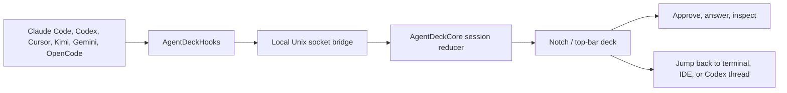
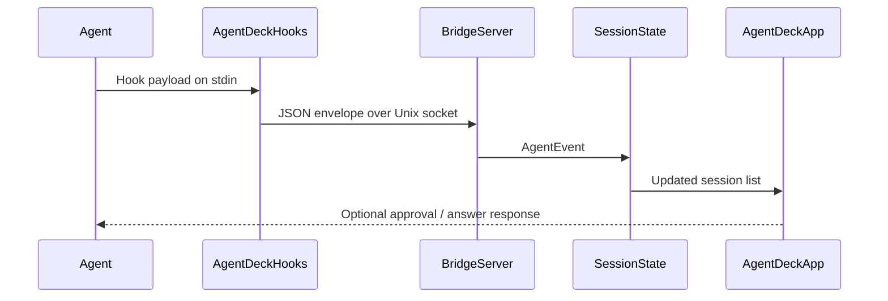

<p align="center">
  
</p>

<h1 align="center">Agent Deck</h1>

<p align="center">
  <strong>A native macOS command deck for AI coding agents.</strong>
  <br>
  Watch live sessions, answer permission prompts, track usage, and jump back to the right terminal without breaking flow.
  <br><br>
  <a href="README.zh-CN.md">中文</a> | <strong>English</strong>
</p>

<p align="center">
  
  
  
  <a href="LICENSE"></a>
</p>

<p align="center">
  <a href="https://github.com/Octane0411/agent-deck/releases">Download</a> ·
  <a href="#quick-start">Quick Start</a> ·
  <a href="#how-it-feels">How It Feels</a> ·
  <a href="#supported-surfaces">Supported Surfaces</a> ·
  <a href="CONTRIBUTING.md">Contributing</a>
</p>

<p align="center">
  
</p>

---

## What It Is

Agent Deck turns your Mac's notch or top bar into a compact control room for AI coding work. It listens to local agent hooks, shows what each session is doing, surfaces permission and question cards, and sends you back to the exact terminal, IDE, tab, pane, or Codex conversation that needs attention.

It is open source, local first, and native macOS. No account. No telemetry. No server in the middle.

## How It Feels

| Moment | What Agent Deck does |
|---|---|
| A coding agent starts working | A small deck appears in the notch/top bar with the agent, workspace, and state. |
| The agent asks for approval | A focused card expands in place, so you can allow, deny, or answer without hunting through terminals. |
| Several agents run at once | Sessions stack into a calm list with status, workspace, command preview, and completion state. |
| You need context | Click the session and Agent Deck jumps back to the right terminal pane, IDE workspace, or Codex thread. |
| You close and reopen the app | Recent sessions are restored from local transcripts and caches. |

## The Deck



The hook path fails open. If Agent Deck is not running, your agents keep working normally.

## Why Use It

- **Own the control layer**: Everything runs locally on your Mac.
- **Stay in flow**: Approvals, questions, completions, and usage signals are visible without switching windows.
- **Jump precisely**: Terminal panes, IDE workspaces, Warp tabs, and Codex desktop threads can reopen from the session card.
- **See the whole board**: One surface for multiple agents, terminals, and workspaces.
- **Build it your way**: SwiftUI + AppKit, GPL v3, scriptable hooks, readable docs.

## Supported Surfaces

**Agent families**

| Agent | Integration |
|---|---|
| Claude Code | Hooks, transcript discovery, status line bridge, usage tracking |
| Codex CLI | Hooks, session tracking, usage windows |
| Codex Desktop App | App-server JSON-RPC events and `codex://threads/<id>` jump-back |
| Cursor | Hook events and workspace jump-back |
| Kimi CLI | TOML hook installer, Claude-compatible hook payloads |
| Gemini CLI | Hook events and session tracking |
| OpenCode | JS plugin, permissions, questions, process detection |
| Qoder, Qwen Code, Factory, CodeBuddy | Claude-compatible hook integrations |

**Terminals and IDEs**

Terminal.app, Ghostty, iTerm2, WezTerm, Zellij, tmux, cmux, Kaku, Warp, VS Code, Cursor, Windsurf, Trae, and JetBrains IDEs.

## Quick Start

### Download

Grab the latest DMG from [GitHub Releases](https://github.com/Octane0411/agent-deck/releases). Open it, drag **Agent Deck** into **Applications**, and launch it.

### Build From Source

```bash
git clone https://github.com/Octane0411/agent-deck.git
cd agent-deck
open Package.swift
```

Run the `AgentDeckApp` target in Xcode.

Requirements:

- macOS 14+
- Swift 6.2+
- Xcode for the app target

### Build a Local App Bundle

```bash
zsh scripts/package-app.sh
```

The script creates:

- `output/package/Agent Deck.app`
- `output/package/Agent Deck.zip`
- `output/package/Agent Deck.dmg`

Set `AGENT_DECK_SIGN_IDENTITY` to sign the bundle. See [docs/packaging.md](docs/packaging.md) for signing and notarization details.

## Install Agent Hooks

Open Agent Deck's Control Center and install hooks from the Setup tab, or use the setup CLI:

```bash
swift build -c release --product AgentDeckHooks
swift run AgentDeckSetup install
swift run AgentDeckSetup status
swift run AgentDeckSetup uninstall
```

Kimi hooks are managed separately:

```bash
swift run AgentDeckSetup installKimi
swift run AgentDeckSetup statusKimi
swift run AgentDeckSetup uninstallKimi
```

Claude usage setup is opt-in. When enabled, Agent Deck writes a managed `statusLine.command` to `~/.agent-deck/bin/agent-deck-statusline`, caches `rate_limits` into `/tmp/agent-deck-rl.json`, and will not overwrite an existing custom status line automatically.

## Architecture

| Target | Role |
|---|---|
| `AgentDeckApp` | SwiftUI + AppKit shell, menu bar, overlay panel, control center, settings |
| `AgentDeckCore` | Models, bridge transport, hook installers, session persistence, reducers |
| `AgentDeckHooks` | Lightweight hook binary called by agents, forwards payloads over a Unix socket |
| `AgentDeckSetup` | CLI installer for managed hook entries |



## Repository Map

- [docs/index.md](docs/index.md): documentation map
- [docs/architecture.md](docs/architecture.md): system design
- [docs/hooks.md](docs/hooks.md): hook events, payloads, and responses
- [docs/quality.md](docs/quality.md): verification approach
- [docs/packaging.md](docs/packaging.md): local packaging, signing, notarization
- [CONTRIBUTING.md](CONTRIBUTING.md): issues, feature requests, and development workflow

## Verification

Useful local checks:

```bash
swift build
swift test
zsh scripts/check-docs.sh
zsh scripts/harness.sh
zsh scripts/package-app.sh
```

## Community

Join the Discord for feedback and development discussion:

[](https://discord.gg/bPF2HpbCFb)

<details>
<summary>WeChat group for Chinese-speaking users</summary>


</details>

## License

[GPL v3](LICENSE)
