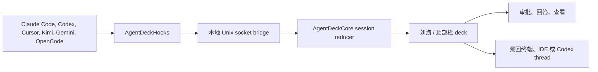
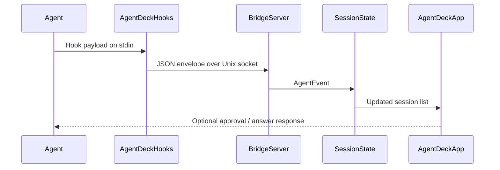
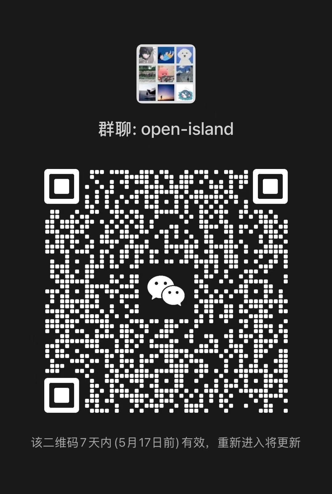

<p align="center">
  
</p>

<h1 align="center">Agent Deck</h1>

<p align="center">
  <strong>面向 AI coding agents 的原生 macOS 指挥台。</strong>
  <br>
  观察会话、处理权限、查看用量，并一键跳回正确的终端、IDE 或 Codex 对话。
  <br><br>
  <strong>中文</strong> | <a href="README.md">English</a>
</p>

<p align="center">
  
  
  
  <a href="LICENSE"></a>
</p>

<p align="center">
  <a href="https://github.com/Octane0411/agent-deck/releases">下载</a> ·
  <a href="#快速开始">快速开始</a> ·
  <a href="#使用时是什么感觉">使用体验</a> ·
  <a href="#支持范围">支持范围</a> ·
  <a href="CONTRIBUTING.zh-CN.md">参与贡献</a>
</p>

<p align="center">
  
</p>

---

## 它是什么

Agent Deck 把 Mac 的刘海或顶部栏变成一个紧凑的 AI agent 指挥台。它监听本地 hooks，显示每个会话正在做什么，弹出权限和问答卡片，并把你带回真正需要注意的终端、IDE、tab、pane 或 Codex 对话。

它开源、本地优先、原生 macOS。无需账号，无遥测，中间没有服务器。

## 使用时是什么感觉

| 场景 | Agent Deck 会做什么 |
|---|---|
| 一个 coding agent 开始工作 | 刘海或顶部栏出现一个小型 deck，显示 agent、workspace 和状态。 |
| agent 请求权限 | 卡片就地展开，你可以直接允许、拒绝或回答，不必翻找终端窗口。 |
| 多个 agent 同时运行 | 会话被整理成清晰列表，展示状态、workspace、命令预览和完成情况。 |
| 你需要回到上下文 | 点击会话即可跳回正确的终端 pane、IDE workspace 或 Codex thread。 |
| 关闭再打开 app | 从本地 transcript 和缓存恢复近期会话。 |

## 指挥台如何工作



Hook 路径默认 fail open。即使 Agent Deck 没运行，你的 agents 也会继续正常工作。

## 为什么值得用

- **控制层属于你**：所有数据和逻辑都在本机运行。
- **不中断 flow**：权限、问题、完成状态和用量信号不用切窗口也能看见。
- **跳回足够精确**：终端 pane、IDE workspace、Warp tab 和 Codex 桌面 thread 都能从会话卡片回去。
- **一眼看全局**：一个界面管理多个 agents、终端和 workspace。
- **可以自己改**：SwiftUI + AppKit，GPL v3，hooks 可脚本化，文档可追踪。

## 支持范围

**Agent 家族**

| Agent | 集成方式 |
|---|---|
| Claude Code | Hooks、transcript 发现、status line bridge、用量追踪 |
| Codex CLI | Hooks、会话追踪、用量窗口 |
| Codex 桌面 App | App-server JSON-RPC 事件和 `codex://threads/<id>` 跳回 |
| Cursor | Hook 事件和 workspace 跳回 |
| Kimi CLI | TOML hook installer，兼容 Claude payload |
| Gemini CLI | Hook 事件和会话追踪 |
| OpenCode | JS 插件、权限、问答、进程检测 |
| Qoder、Qwen Code、Factory、CodeBuddy | 兼容 Claude 的 hook 集成 |

**终端和 IDE**

Terminal.app、Ghostty、iTerm2、WezTerm、Zellij、tmux、cmux、Kaku、Warp、VS Code、Cursor、Windsurf、Trae，以及 JetBrains IDEs。

## 快速开始

### 下载

从 [GitHub Releases](https://github.com/Octane0411/agent-deck/releases) 下载最新 DMG。打开后把 **Agent Deck** 拖入 **Applications**，然后启动。

### 从源码构建

```bash
git clone https://github.com/Octane0411/agent-deck.git
cd agent-deck
open Package.swift
```

在 Xcode 中运行 `AgentDeckApp` target。

系统要求：

- macOS 14+
- Swift 6.2+
- Xcode，用于运行 app target

### 构建本地 App 包

```bash
zsh scripts/package-app.sh
```

脚本会生成：

- `output/package/Agent Deck.app`
- `output/package/Agent Deck.zip`
- `output/package/Agent Deck.dmg`

设置 `AGENT_DECK_SIGN_IDENTITY` 可以签名。签名和公证流程见 [docs/packaging.md](docs/packaging.md)。

## 安装 Agent Hooks

打开 Agent Deck 的 Control Center，在 Setup tab 中安装 hooks；也可以使用 CLI：

```bash
swift build -c release --product AgentDeckHooks
swift run AgentDeckSetup install
swift run AgentDeckSetup status
swift run AgentDeckSetup uninstall
```

Kimi hooks 单独管理：

```bash
swift run AgentDeckSetup installKimi
swift run AgentDeckSetup statusKimi
swift run AgentDeckSetup uninstallKimi
```

Claude usage 设置保持 opt-in。启用后，Agent Deck 会把受管 `statusLine.command` 写入 `~/.agent-deck/bin/agent-deck-statusline`，把 `rate_limits` 缓存到 `/tmp/agent-deck-rl.json`，并且不会自动覆盖已有自定义 status line。

## 架构

| Target | 角色 |
|---|---|
| `AgentDeckApp` | SwiftUI + AppKit shell、菜单栏、覆盖面板、控制中心、设置 |
| `AgentDeckCore` | 模型、bridge 传输、hook installers、会话持久化、reducers |
| `AgentDeckHooks` | 被 agents 调用的轻量 hook binary，通过 Unix socket 转发 payload |
| `AgentDeckSetup` | 管理 hooks 条目的 CLI installer |



## 仓库导航

- [docs/index.md](docs/index.md)：文档地图
- [docs/architecture.md](docs/architecture.md)：系统设计
- [docs/hooks.md](docs/hooks.md)：hook 事件、payload 和响应格式
- [docs/quality.md](docs/quality.md)：质量基线和验证方式
- [docs/packaging.md](docs/packaging.md)：本地打包、签名、公证
- [CONTRIBUTING.zh-CN.md](CONTRIBUTING.zh-CN.md)：issue、功能建议和开发流程

## 验证

常用本地检查：

```bash
swift build
swift test
zsh scripts/check-docs.sh
zsh scripts/package-app.sh
```

## 社区

加入 Discord 参与反馈和开发讨论：

[](https://discord.gg/bPF2HpbCFb)

<details>
<summary>微信群</summary>



</details>

## License

[GPL v3](LICENSE)
