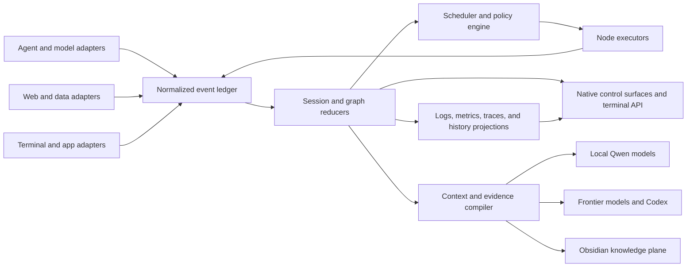

# Capability-First Agent Orchestration Control Plane

**Status:** Active
**Started:** 2026-07-19
**Current phase:** Phase 2, first real local executor adapter preparation

## Problem

Open Island already has useful agent adapters, process discovery, approvals, questions,
usage readers, and macOS surfaces. It is still primarily a session companion. The target
is a local-first orchestration control plane that can run and supervise multi-model graphs,
explain every state transition, operate research pipelines, and route durable context among
local models, frontier models, Codex, terminals, and Obsidian.

Project ancestry is not an architectural constraint. Jarvis may become a voice or command
adapter, but it is not the privileged controller. Open Island owns orchestration state and
policy because every interface must observe and operate the same graph.

## Product Directives

1. Design around capabilities and behaviors, not project names.
2. Treat a host application, process, session, turn, graph run, and graph node as different
   lifecycle scopes.
3. Show only active or attention-requiring work on live surfaces. Completed and idle work
   moves to history immediately and must not reappear through fallback discovery.
4. Make events, logs, metrics, model calls, tools, resources, approvals, failures, retries,
   handoffs, checkpoints, and artifacts first-class data.
5. Use one normalized event contract across Qwen, Codex, Claude-family tools, Gemini,
   OpenCode, Cursor, web workers, and future providers.
6. Keep durable knowledge in user-controlled storage. Obsidian is the primary knowledge
   plane; Open Island owns run state and provenance; provider-specific memory is imported
   or exported through explicit context bundles.
7. Fail open at adapter boundaries, but fail visibly inside a graph. Silent loss of state
   is not acceptable.

## Repository Audit

The audit covered the complete repository file inventory, source and test symbol scans,
documentation, scripts, and deep reads of the runtime paths that own events, discovery,
liveness, state reduction, persistence, app-server integration, controls, and UI.

### Existing foundations

- Native SwiftUI/AppKit overlay and settings surfaces
- Unix-socket bridge and normalized `AgentEvent` reducer
- Adapters for Codex, Claude-family tools including Qwen, Gemini, OpenCode, and Cursor
- Process, transcript, app-server, and terminal-session discovery
- Approval and structured-question round trips
- Session metadata, subagent/task display, usage readers, notifications, and jump targets
- Local persistence, SSH transport, packaging, signing, update, and harness infrastructure

### Structural gaps

- Desktop host-process liveness was treated as per-thread liveness.
- Live state and historical state were mixed, allowing inactive sessions to linger or return.
- Agent events updated the latest session snapshot but did not form an operator-visible ledger.
- Usage metrics exist, but run, node, model, tool, cost, latency, and resource metrics are not
  normalized.
- Subagents are metadata, not graph nodes with typed handoffs, budgets, retries, and checkpoints.
- There is no scheduler, graph definition, artifact registry, evidence graph, context compiler,
  evaluation layer, or unified terminal control API.

### Recovered graph work

The graph feature is not a greenfield phase. Two earlier implementations are available and
must be recovered before new graph abstractions are designed:

- The original Open Island worktree contains an uncommitted native graph substrate:
  `AgentTaskGraph`, `AgentGraphExecutor`, `SessionGraphCatalog`, a simulation model, graph
  catalog and inspector views, a graph window controller, and core executor tests. It already
  models DAG dependencies, bounded parallel batches, node states, cycle detection, and
  success/failure outputs. Recover this code deliberately from the dirty worktree without
  modifying or deleting the user's other uncommitted files.
- The dose-regulations compendium repository contains a committed four-role Qwen workflow:
  architect and researcher fan out in isolated worktrees, graph engineering fans in their
  commits, and an independent reviewer gates the result. Role contracts, path allowlists,
  handoff files, tmux launchers, status scripts, and model assignments are already present.

The latest compendium graph attempt is also the first failure-replay fixture. The architect
hit a tool-call limit and the researcher timed out, but both retained only `.started` markers
and idle tmux shells, so the status command still reports them as running. The native runtime
must replace this marker-based inference with authoritative process exit, node state, timeout,
error, retry, and terminal-session evidence.

### Native prototype recovery inventory

Only the portable definition, compatibility executor, and core tests were copied from the
dirty source worktree. The source worktree, its stash, unrelated translation work, and graph
UI files were not modified. "Discard" below means do not migrate the type into the
authoritative runtime; it does not authorize deleting the source-worktree copy.

| Recovered type | Classification | Decision |
|---|---|---|
| `AgentTaskNodeState` | replace | Keep for prototype compatibility; `ReconciledExecutionState` owns persisted runtime truth. |
| `AgentExecutionKind` | amend | Keep for prototype decoding; migrate assignments to adapter-neutral executor registry IDs. |
| `AgentTaskNode` | replace | It mixes definition, output, timestamps, and process state; split runtime identity and attempts into canonical records. |
| `AgentTaskEdge` | reusable | Preserve as the declarative dependency primitive until typed ports require a versioned edge schema. |
| `AgentTaskGraph` | amend | Preserve cycle/dependency behavior as an import and simulation model; remove runtime-state ownership during graph-definition versioning. |
| `AgentTaskExecutionResult` | amend | Replace its output string with typed artifact and handoff envelopes when executor adapters arrive. |
| `AgentGraphExecutionError` | reusable | Preserve cycle and stalled-graph diagnostics; extend with structured reasons at the scheduler boundary. |
| `AgentGraphExecutor` | amend | Retain as a deterministic compatibility/simulation actor; a ledger-backed scheduler will replace it for production execution. |
| private `NodeOutcome` | discard | Batch-local transport only; authoritative outcomes are `ExecutionEvent` and `ExecutionAttempt` records. |
| `AgentTaskGraphTests` | reusable | Preserve the recovered dependency, cycle, and bounded-execution regression coverage. |

Prototype candidates inspected but deliberately not recovered in this round:

| Source artifact | Types | Classification and disposition |
|---|---|---|
| `SessionGraphCatalog.swift` | `SessionGraphSummary`, `SessionGraphCatalog`, private `GraphIdentity` | amend later; workspace-grouped sessions are a presentation projection, not a DAG. |
| `AgentGraphPrototypeModel.swift` | `AgentGraphPrototypeModel` | discard after migration; it is a hard-coded timed simulation. |
| `AgentTaskGraphPrototypeView.swift` | `AgentTaskGraphPrototypeView`, private node card and layout types | amend later against reconciled graph projections; no UI recovery in this task. |
| `IslandGraphCatalogView.swift` | `IslandGraphCatalogView`, private row type | amend later to consume real graph runs instead of workspace groupings. |
| `SessionGraphWindowView.swift` | `SessionGraphWindowView`, private canvas, node, layout, and edge types | amend later; visual topology is useful but inferred sequential edges are not authoritative. |
| `SessionGraphWindowController.swift` | `SessionGraphWindowController` | reusable later as window lifecycle infrastructure. |
| `LabSettingsPane.swift` | `LabSettingsPane` | discard as the graph-runtime owner; future navigation can host the recovered inspector without owning execution. |

### Canonical execution records

All canonical records are provider- and terminal-neutral. Adapter code may inspect tmux,
process tables, provider storage, or marker files, but it must translate observations into
these records before reconciliation.

| Model | Authority |
|---|---|
| `GraphRun` | Identity and aggregate reconciled state for one execution of a versioned graph. |
| `GraphNode` | Run-scoped dependency projection, executor registry ID, and latest reconciled node state. |
| `ExecutionAttempt` | Monotonic retry ordinal, process ownership, lifecycle state, reason, and timing for one node attempt. |
| `ProcessIdentity` | Opaque host and launch identity, with optional OS process metadata to prevent PID reuse ambiguity. |
| `ProcessExit` | Adapter observation that an owned process ended; an exit code alone never proves task completion. |
| `ExecutorHeartbeat` | Time-bounded lease proving that a matching executor instance was recently alive. |
| `ExecutionEvent` | Ordered explicit lifecycle fact, including business-level completion, failure, interruption, or cancellation. |
| `ReconciledExecutionState` | Shared state vocabulary: pending, ready, running, completed, failed, interrupted, orphaned, blocked, cancelled. |

`ExecutionReconciliationInput` is the adapter handoff and
`ExecutionReconciliationResult` is the disposable authoritative projection.
`GraphExecutionReconciler` is deterministic and side-effect-free: it performs no process
inspection, file access, clock reads, persistence, command execution, or provider decoding.

### Reconciliation precedence

Attempt evidence is evaluated in this exact order:

1. The latest explicit terminal attempt event wins, ordered by `(sequence, occurredAt, id)`.
2. A matching process exit without a terminal attempt event yields `interrupted`, including
   exit code zero; business success requires an explicit completion event.
3. A matching heartbeat whose lease includes `observedAt` yields `running`.
4. A persisted or explicitly started running attempt without current evidence yields
   `orphaned` when it has a recorded process identity.
5. The same unsupported running claim yields `interrupted` when no process identity can be
   recovered.
6. Non-running attempt state is retained when none of the preceding evidence applies.

Node dependency state is then recomputed to a fixed point, followed by run aggregation.
Input ordering cannot change the result.

| Condition | Attempt/node transition | Downstream/run consequence |
|---|---|---|
| explicit completion event | `running -> completed` | dependents can become `ready`; all-complete run becomes `completed` |
| explicit failure event | `running -> failed` | unstarted dependents become `blocked`; inactive run becomes `failed` |
| explicit interruption event or process exit | `running -> interrupted` | unstarted dependents become `blocked`; inactive run becomes `interrupted` |
| stale lease with known process identity | `running -> orphaned` | unstarted dependents become `blocked`; inactive run becomes `orphaned` unless a higher aggregate failure exists |
| unsupported start with no identity | `running -> interrupted` | unstarted dependents become `blocked` |
| valid matching heartbeat | persisted state becomes/remains `running` | run remains `running` while active work exists |
| every dependency completed | `pending/blocked -> ready` | node is eligible for a future scheduler decision |
| any dependency failed, interrupted, orphaned, cancelled, or blocked | `pending/ready -> blocked` | blocking propagates transitively |
| dependencies remain active or pending | `ready/blocked -> pending` | no execution is authorized |

### Migration decisions

- Existing `AgentTaskGraph` JSON remains a compatibility/import format, not the persistence
  schema for live execution.
- Canonical IDs are opaque strings so adapters can preserve external stable IDs; prototype
  UUIDs are serialized into strings at the migration boundary.
- `AgentExecutionKind` maps to an executor registry ID. Core state never switches directly on
  Qwen, Codex, Ollama, tmux, rollout files, or marker-file concepts.
- Persisted `running` state is always reconciled before a scheduler or operator surface reads
  it. A snapshot cannot make itself authoritative.
- Process and provider adapters emit `ProcessExit`, `ExecutorHeartbeat`, and `ExecutionEvent`
  evidence. They do not mutate node state.
- The stale compendium architect/researcher run is committed as an adapter-neutral JSON
  fixture. It is the restart baseline for interrupted/orphaned recovery and transitive
  dependency blocking.
- Durable persistence and replay now use a versioned event envelope, deterministic projector,
  snapshot cache boundary, evidence-isolated repository, and transactional SQLite store.
  Temporal inspection, durable scheduling, mutation commands, and deterministic execution now
  share that history. The next boundary is one supervised local process adapter.

## Target Architecture



The event ledger is the source of truth. Reducers build disposable projections for active
sessions, graph runs, metrics, timelines, notifications, and history. Commands carry expected
state versions so stale approvals or retries cannot mutate the wrong turn.

Every executable node implements a common capability contract:

- identity and parent graph/run/node relationships
- lifecycle state and explicit reason
- model, account, context-window, and resource assignment
- typed input, output, artifact, and handoff envelopes
- tool calls and permission boundaries
- timestamps, token/cost/latency/resource metrics
- retry, timeout, cancellation, checkpoint, and compensation policy
- provenance links from claims to sources and transformations

## AgentPeek Capability Parity

The parity target is the behavior documented in AgentPeek's current product documentation,
not its visual styling.

| Capability | Required Open Island behavior | Phase |
|---|---|---|
| Compact live surface | Active rows with executing, thinking, waiting, idle, and attention state | 1-2 |
| Activity and tool state | Current action, tool icon, command/input preview, and elapsed time | 1-2 |
| Session metrics | Tokens, files touched, commands, diff lines, elapsed time, cost, and terminal | 1-2 |
| Runtime metadata | Model, account, branch, context pressure, and subagent count | 2 |
| Plans and todos | Live checklist with progress and focused plan view | 2 |
| Latest response | Expandable Markdown response with full transcript route | 2 |
| Timeline | Prompts, tools, permissions, questions, compactions, responses, failures, and retries | 1-2 |
| Focused inspectors | Transcript, subagents, todos, tools, logs, metrics, artifacts, and graph views | 2 |
| Nested subagents | Parent-child timelines, independent state, jump, export, cancel, and retry | 2-3 |
| Session actions | Jump, copy ID/path, reveal files, dismiss, end, retry, fork, and export | 2 |
| Inline permissions | Command/path/diff context, allow once, deny, persistent rule, and feedback | 2 |
| Structured questions | Single/multi-select, freeform, annotations, timeout, and graph resumption | 2 |
| Prompt composer | Follow-up, streaming response, cancel, queued prompts, and resume | 2 |
| Quick routes | Skills, plugins, config, logs, workspace root, artifacts, and source files | 2 |
| Usage dashboards | Active, 5-hour, 7-day, monthly, daily, raw token/spend, reset, and per-model views | 2 |
| Floating widgets | Todos, usage, transcript, subagents, tools, graph health; multi-display persistence | 3 |
| Agent board | Active, attention, blocked, retrying, and finished columns | 3 |
| Notifications | Permission, budget, spend, pace, account handoff, stuck, task, quiet hours, and tests | 3 |
| Local server discovery | Running dev servers with open, copy, inspect, and terminate actions | 3 |
| Fast actions | Configurable commands and scripts with project context | 3 |
| Views and menu bar | Named operator layouts, shortcuts, and low-friction background controls | 3 |
| Settings and doctor | General, appearance, usage, notifications, shortcuts, performance, health, and about | 3 |

Reference baseline:

- <https://agentpeek.app/docs/>
- <https://agentpeek.app/github-copilot/>
- <https://agentpeek.app/permissions/>
- <https://agentpeek.app/notifications/>
- <https://agentpeek.app/views/>
- <https://agentpeek.app/fast-actions/>
- <https://agentpeek.app/log/>

## Capabilities Beyond AgentPeek

### Graph orchestration

- Declarative DAG and hierarchical graph definitions with typed ports
- Dynamic fan-out/fan-in, conditional routing, loops with explicit bounds, and human gates
- Model router for local Qwen variants, Codex/frontier models, and specialist agents
- Capacity-aware scheduling across RAM, VRAM, context windows, concurrency, cost, and deadlines
- Typed handoffs that preserve objective, evidence, artifacts, open questions, and budget
- Checkpoint/resume, retries with backoff, fallback models, cancellation propagation, and replay
- Evaluator/critic nodes and policy-driven quality gates before synthesis or publication

### Research and compendium production

The dose-calculation regulations compendium becomes the first acceptance workload:

```mermaid
flowchart LR
    S["Scope and jurisdictions"] --> P["Source planner"]
    P --> C["Crawler and scraper workers"]
    C --> N["Normalize and deduplicate"]
    N --> E["Extract claims, rules, tables, and citations"]
    E --> V["Source and contradiction validators"]
    V --> Y["Synthesis and gap analysis"]
    Y --> H["Human review gate"]
    H --> O["Obsidian publisher and export"]
```



Required behavior includes robots/rate-limit policy, source snapshots, canonical URLs,
content hashes, jurisdiction/effective-date metadata, claim-level citations, contradiction
tracking, stale-source detection, and replayable transformations. No regulation claim may be
published without source provenance.

### Memory and context

- Obsidian stores curated evergreen notes, compendiums, source records, decisions, and indexes.
- Open Island stores graph/run state, event history, artifacts, provenance, metrics, and
  context-manifest versions.
- A context compiler selects only relevant vault notes, prior outcomes, user preferences,
  source evidence, and tool schemas for each node.
- Codex and other frontier clients receive versioned context bundles rather than uncontrolled
  vault dumps.
- Local Qwen workers can use local embeddings and retrieval while preserving the same evidence
  and access-control contract.

### Terminal control plane

The terminal interface should eventually support:

```text
openisland status
openisland sessions --active
openisland graph run compendium.yaml
openisland graph inspect <run-id>
openisland logs <run-id> --follow
openisland metrics <run-id>
openisland approve|deny|answer <request-id>
openisland retry|cancel|resume <node-id>
openisland artifacts <run-id>
openisland context explain <node-id>
openisland vault publish <artifact-id>
```

The native app, terminal, future voice interface, and Codex integration call the same command
service. None owns a parallel execution path.

## Delivery Phases

### Phase 1: Session truth and observability

Goal: make live state trustworthy and establish the common telemetry vocabulary.

- [x] Hide completed/idle Codex desktop threads immediately even when the host app remains open.
- [x] Import only active app-server threads.
- [x] Prevent completed or stale rollout records from resurrecting inactive desktop sessions.
- [x] Add a normalized, bounded, persisted session timeline.
- [x] Add aggregate event, tool, attention, completion, and elapsed metrics.
- [x] Show recent timeline entries and core metrics in expanded live rows.
- [x] Add lifecycle, deduplication, persistence, visibility, and rediscovery tests.
- [x] Prune completed Codex records during startup and active-state persistence.
- [x] Verify completed thread `019f2afd-e6fd-7e11-bdd4-945caba06867` cannot re-enter
  the active island through cache or rollout restoration.
- [ ] Capture structured errors and explicit state-transition reasons from every adapter.
- [ ] Add active/history projections backed by an append-only event store.
- [ ] Add model, token, cost, file, diff, command, latency, and resource metric events.

Exit criteria: the active list has no ghost desktop sessions; each active session explains its
recent state transitions; polling cannot inflate metrics; timeline state survives persistence.

### Phase 2: Recover and supervise the graph runtime

- [x] Recover the portable native graph model, compatibility executor, and tests without
  modifying the original dirty worktree.
- [x] Inventory every recovered type and explicitly retain, amend, replace, or discard it.
- [x] Add canonical run, node, attempt, process, heartbeat, exit, event, and reconciled-state
  records.
- [x] Implement deterministic side-effect-free execution reconciliation.
- [x] Commit the stale architect/researcher run as an adapter-neutral fixture and prove
  interrupted/orphaned recovery plus transitive downstream blocking.
- [x] Add append-only execution-event persistence and snapshot repositories behind protocols.
- [x] Add optimistic concurrency, idempotent append, deterministic replay, explicit corruption
  policy, and a production local SQLite implementation.
- [x] Add a process-evidence boundary and reconcile persisted runs on every repository read,
  returning projection and diagnostics when evidence is unavailable.
- [x] Add content-addressed artifact references, checkpoint/fork metadata, durable human
  interrupt facts, and OpenTelemetry-compatible internal vocabulary.
- [x] Prove restart, replay, snapshots, concurrent writers, unknown events, retry ordinals,
  sibling-write preservation, fixed-point reconciliation, and the stale compendium fixture.
- [x] Expose read-only temporal APIs and `openisland graph` commands for list, inspect,
  history, explain, checkpoints, replay, diff, and redacted export.
- [x] Add stable text, JSON, JSONL, completion, exit-code, telemetry, Unix pipeline, worktree,
  multi-project, and neutral Terminal Graph workspace-plan contracts.
- [ ] Implement host-specific process-evidence adapters that emit canonical evidence.
- [x] Add deterministic event-sourced scheduler decisions, runnable selection, fixed-point
  dependency failure propagation, and explicit reason codes.
- [x] Add optimistic executor claims, renewable generation-fenced leases, explicit expiry and
  release, exact-redelivery idempotency, and competing-writer exclusion.
- [x] Add versioned retry/backoff policy, cancellation request/acknowledgement/terminal
  protocol, and five explicit timeout decision kinds.
- [x] Prove crash-before/after-claim behavior, SQLite contention/restart/takeover, retry-delay
  recovery, scheduler idempotency, snapshot compatibility, and the four-node compendium
  success/failure/cancellation scenarios.
- [x] Extend read-only graph inspection with schema-versioned policy, claim, lease, retry,
  cancellation, timeout, and scheduler-reason projections while preserving schema version 1.
- [x] Add version-checked graph create, start, step, run, cancel, and retry commands with stable
  text, JSON, JSONL, dry-run, exit-code, and expected-head contracts.
- [x] Add a provider-neutral typed executor adapter, exact identity fencing, durable
  intent/observation separation, terminal declarations, and content-addressed artifact handoffs.
- [x] Add a bounded restart-safe orchestration service that schedules, claims, starts,
  observes, renews leases, collects results, cleans up, releases claims, propagates
  dependencies, and aggregates run outcomes without holding transactions across adapters.
- [x] Execute the committed architect -> researcher -> graph -> reviewer fixture end to end with
  deterministic retry, cancellation, timeout, stale-generation, duplicate, crash, SQLite
  restart, replay, diff, export, and pipeline evidence.
- [ ] Implement the first real supervised process executor for one local compendium node.
- [ ] Add typed handoff schemas on top of artifact references, then supervise a graph with at
  least two local models.
- [ ] Add graph logs and metric projections to the shared command service; temporal graph
  inspection is now exposed through the standalone CLI boundary.

### Phase 3: Usage, inspection, and visual control plane

- Implement CLI-specific usage collectors for non-local models, separated from local-model
  resource telemetry. Normalize provider, CLI surface, account, model, billing window, token
  counts, context pressure, spend, reset time, quota state, and collection freshness.
- Show AgentPeek-class session and graph inspectors for timeline, transcript, tools, todos,
  subagents, logs, metrics, artifacts, handoffs, graph health, and provider usage.
- Add plans, follow-up/cancel, exports, quick routes, richer permissions, structured questions,
  active/history browsing, and account/model-level usage views.

### Phase 4: Research and knowledge plane

Implement the web evidence pipeline, compendium schema, validators, source snapshots,
claim-level provenance, contradiction handling, stale-source detection, Obsidian publishing,
vault indexes, and context compiler. Complete a replayable dose-calculation regulations
compendium run with review checkpoints.

### Phase 5: Expanded operator surfaces

Build the agent board, floating widgets, saved layouts, menu-bar controls, local-server
discovery, fast actions, notifications, budgets, quiet hours, performance controls, and a
runtime doctor. Visual redesign, including a liquid-glass system, is explicitly deferred
until these surfaces and their information architecture are stable.

### Phase 6: Frontier/Codex integration and evaluation

Expose the command and context services to Codex and frontier models, add model-selection
policies and eval suites, benchmark local/frontier handoffs, and enforce regression budgets
for quality, latency, cost, and context growth.

## Immediate Execution Order

1. **Complete:** temporal inspection APIs for list, inspect, history, explain, checkpoint
   listing, dry-run replay, diff, and export.
2. **Complete:** read-only `openisland graph` CLI commands with stable JSON/JSONL, causal
   explanations, replay diagnostics, bounded telemetry, and optional completion records.
3. **Complete:** redacted artifact and repository-context exports plus deterministic neutral
   workspace plans. Event/snapshot integrity policy remains enforced by the durable store.
4. **Complete:** durable scheduling decisions, claims, renewable leases, retry,
   cancellation, timeout, fixed-point failure propagation, schema v2 read-only inspection,
   and SQLite restart/concurrency behavior.
5. **Complete:** mutation commands, provider-neutral executor protocol, fenced observation
   repository, bounded orchestration cycles, deterministic executor, artifact propagation,
   lease renewal, and four-node compendium execution across crash and restart boundaries.
6. **Next:** implement one supervised local direct-process or tmux executor with durable
   process identity and bounded log/artifact capture, then connect only the architect node.
7. Implement host-specific process-evidence adapters that translate observations into
   canonical exits and heartbeat leases without mutating history.
8. Add non-local CLI usage metrics and local-model resource metrics as distinct projections.
9. Add provider/model executors only after the local process adapter proves the command,
   event, fencing, and recovery contracts.
10. Defer all visual redesign, including liquid glass, until orchestration behavior and
   operator information architecture are stable.

## Progress Log

- `fa64908 feat: recover native graph prototype`
- `64a2bde feat: add authoritative graph execution state`
- `6d3aa58 test: add stale compendium runtime fixture`
- `79d7d1a docs: refine orchestration state and recovery plan`
- `187367d fix: make graph reconciliation evidence ordering total`
- `a4571b2 feat: add graph execution event store`
- `fcb812b feat: add deterministic graph replay repository`
- `2fc35b6 feat: add local SQLite graph persistence`
- `38d0fc1 test: prove durable graph replay invariants`
- `4f55d79 test: cover graph provenance and telemetry boundaries`
- `77e017d docs: define durable graph history philosophy`
- `d2c80cd feat: add temporal graph inspection APIs`
- `3353374 feat: add read-only openisland graph commands`
- `ed5ece0 feat: add terminal graph compatibility contracts`
- `d1d7ce6 test: verify graph cli and streaming invariants`
- `5746c87 feat: add deterministic graph scheduler decisions`
- `a188b1a feat: add executor claims and renewable leases`
- `7c63d59 feat: add retry cancellation and timeout protocols`
- `395e6f5 test: prove scheduling concurrency and restart invariants`
- `1fc3837 feat: add graph mutation service and commands`
- `3342dac feat: add executor adapter and fencing protocol`
- `54cea48 feat: add deterministic compendium executor`
- `0b2628b feat: add bounded graph orchestration cycles`
- `4b3333f test: prove graph execution and restart invariants`
- `5864b22 fix: remove cursor-sensitive test nondeterminism`
- `15a47c8 feat: renew active orchestration leases`

### Temporal inspection and integration decisions

- The inspector depends on bounded read-store and snapshot-read protocols rather than SQLite.
  Historical replay is side-effect-free and never updates snapshots.
- Output schema version 2 adds scheduling policy, claims, leases, retries, cancellation,
  timeout, and reason-code inspection. Version 1 remains selectable. Text, JSON documents,
  and one-record-per-line JSONL remain deterministic; diagnostics stay on stderr unless
  requested.
- Open Island remains execution authority. Terminal Graph integration uses optional
  environment context, typed semantic ports, stable external mapping keys, and a neutral
  workspace plan; no Terminal Graph binary, private schema, state file, hook, or MCP call is
  required.
- Repository and artifact metadata is redaction-aware. CLI telemetry is bounded, local, and
  excludes raw arguments, paths, environment values, prompts, and artifact bodies.
- Durable scheduler decisions, exclusive ownership, mutation commands, and deterministic
  execution are complete. The next correctness boundary is durable process identity and
  recovery for one supervised local executor.

### Durable scheduling and ownership decisions

- The pure scheduler consumes definition, projection, reconciliation, policy, logical time,
  capabilities, claims/leases, and failure categories, then proposes events without I/O.
- Event-sourced claims use the existing expected-head append transaction for exclusion; lease
  generation is the executor fencing value and process liveness does not imply ownership.
- Retry delay and bounded jitter are deterministic and recorded. Cancellation is a four-stage
  protocol. Historical timeouts are explicit events, never replay-time wall-clock inference.
- Schema migration is additive: no SQLite table migration is needed; old snapshots default a
  missing scheduling projection to empty, old evaluation events may omit embedded policy, and
  CLI schema version 1 remains supported alongside version 2.
- The committed scheduling fixture is `architect -> researcher -> graph -> reviewer`, with
  capability-specific workers and complete success, failure, retry, cancellation, contention,
  and restart evidence.
- See [ADR 002](../../architecture-decisions/002-durable-graph-scheduling.md) for the event
  taxonomy, phase table, precedence, transaction semantics, migration decisions, and complete
  requirement audit.

### Mutation and executor decisions

- `GraphExecutableDefinition` persists immutable node execution specifications, capability
  requirements, workspace scope, environment-name allowlists, timeout policy, and artifact
  roles. It does not contain provider credentials or unrestricted commands.
- Mutation requests, scheduling decisions, claim ownership, start intent, adapter
  observations, and terminal declarations are separate event classes. No CLI or adapter
  return value mutates a projection directly.
- Executor requests carry run, node, attempt, claim, executor, and lease-generation identity.
  The repository rejects stale generations, inactive claims, mismatched owners, wrong
  ordinals, completion before start, and invalid artifact provenance with stable codes.
- A cycle persists intent before adapter work, performs adapter calls outside database
  transactions, persists observations afterward at the expected head, and only then derives
  terminal declarations. Active leases renew at half-life and every later interaction uses the
  new fencing generation.
- The committed deterministic fixture produces references only: section plan, researched
  sections, relationship graph, and review verdict. Downstream resolution validates producer
  run, node, attempt, ordinal, claim, role, digest, and completed-attempt provenance.
- SQLite reopen, both start crash windows, retry delay, stale executor, cancellation, timeout,
  duplicate observation, byte-identical replay, temporal diff, graph export, JSONL completion,
  Unix pipe, and full app regression tests are the readiness baseline.
- See [ADR 003](../../architecture-decisions/003-graph-mutation-and-executor-boundary.md) for
  mutation semantics, adapter operations, fencing, lifecycle, transaction boundaries, crash
  recovery, artifact flow, compendium execution, and real-adapter readiness criteria.

## Verification

Every phase requires:

- reducer and adapter unit tests for all lifecycle transitions
- replay tests from captured event fixtures
- no-ghost-session and no-duplicate-metric regressions
- graph crash/retry/cancel/resume fault injection
- performance checks for idle CPU, memory, event throughput, and UI update rate
- visual verification for compact/expanded views on notch, non-notch, and external displays
- provenance tests that trace every published claim to a stored source snapshot
- a committed execution round on a feature branch

## Risks

- Provider hooks differ in completeness; adapters must report confidence and degraded modes.
- Transcript formats and desktop app-server protocols can change without notice.
- Event history can grow without bounds unless retention and compaction are policy-controlled.
- Local model concurrency can exhaust RAM/VRAM; scheduling must reserve resources before launch.
- Vault retrieval can leak irrelevant or sensitive context; manifests need explicit scopes.
- Regulations research is high stakes; provenance and human review are release gates, not polish.
