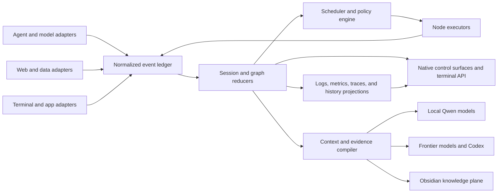

# Capability-First Agent Orchestration Control Plane

**Status:** Active
**Started:** 2026-07-19
**Current phase:** Phase 1, session truth and observability

## Problem

Open Island already has useful agent adapters, process discovery, approvals, questions,
usage readers, and macOS surfaces. It is still primarily a session companion. The target
is a local-first orchestration control plane that can run and supervise multi-model graphs,
explain every state transition, operate research pipelines, and route durable context among
local models, frontier models, Codex, terminals, and Obsidian.

Project ancestry is not an architectural constraint. Jarvis may become a voice or command
adapter, but it is not the privileged controller. Open Island owns orchestration state and
policy because every interface must observe and operate the same graph.

## Product Directives

1. Design around capabilities and behaviors, not project names.
2. Treat a host application, process, session, turn, graph run, and graph node as different
   lifecycle scopes.
3. Show only active or attention-requiring work on live surfaces. Completed and idle work
   moves to history immediately and must not reappear through fallback discovery.
4. Make events, logs, metrics, model calls, tools, resources, approvals, failures, retries,
   handoffs, checkpoints, and artifacts first-class data.
5. Use one normalized event contract across Qwen, Codex, Claude-family tools, Gemini,
   OpenCode, Cursor, web workers, and future providers.
6. Keep durable knowledge in user-controlled storage. Obsidian is the primary knowledge
   plane; Open Island owns run state and provenance; provider-specific memory is imported
   or exported through explicit context bundles.
7. Fail open at adapter boundaries, but fail visibly inside a graph. Silent loss of state
   is not acceptable.

## Repository Audit

The audit covered the complete repository file inventory, source and test symbol scans,
documentation, scripts, and deep reads of the runtime paths that own events, discovery,
liveness, state reduction, persistence, app-server integration, controls, and UI.

### Existing foundations

- Native SwiftUI/AppKit overlay and settings surfaces
- Unix-socket bridge and normalized `AgentEvent` reducer
- Adapters for Codex, Claude-family tools including Qwen, Gemini, OpenCode, and Cursor
- Process, transcript, app-server, and terminal-session discovery
- Approval and structured-question round trips
- Session metadata, subagent/task display, usage readers, notifications, and jump targets
- Local persistence, SSH transport, packaging, signing, update, and harness infrastructure

### Structural gaps

- Desktop host-process liveness was treated as per-thread liveness.
- Live state and historical state were mixed, allowing inactive sessions to linger or return.
- Agent events updated the latest session snapshot but did not form an operator-visible ledger.
- Usage metrics exist, but run, node, model, tool, cost, latency, and resource metrics are not
  normalized.
- Subagents are metadata, not graph nodes with typed handoffs, budgets, retries, and checkpoints.
- There is no scheduler, graph definition, artifact registry, evidence graph, context compiler,
  evaluation layer, or unified terminal control API.

### Recovered graph work

The graph feature is not a greenfield phase. Two earlier implementations are available and
must be recovered before new graph abstractions are designed:

- The original Open Island worktree contains an uncommitted native graph substrate:
  `AgentTaskGraph`, `AgentGraphExecutor`, `SessionGraphCatalog`, a simulation model, graph
  catalog and inspector views, a graph window controller, and core executor tests. It already
  models DAG dependencies, bounded parallel batches, node states, cycle detection, and
  success/failure outputs. Recover this code deliberately from the dirty worktree without
  modifying or deleting the user's other uncommitted files.
- The dose-regulations compendium repository contains a committed four-role Qwen workflow:
  architect and researcher fan out in isolated worktrees, graph engineering fans in their
  commits, and an independent reviewer gates the result. Role contracts, path allowlists,
  handoff files, tmux launchers, status scripts, and model assignments are already present.

The latest compendium graph attempt is also the first failure-replay fixture. The architect
hit a tool-call limit and the researcher timed out, but both retained only `.started` markers
and idle tmux shells, so the status command still reports them as running. The native runtime
must replace this marker-based inference with authoritative process exit, node state, timeout,
error, retry, and terminal-session evidence.

## Target Architecture



The event ledger is the source of truth. Reducers build disposable projections for active
sessions, graph runs, metrics, timelines, notifications, and history. Commands carry expected
state versions so stale approvals or retries cannot mutate the wrong turn.

Every executable node implements a common capability contract:

- identity and parent graph/run/node relationships
- lifecycle state and explicit reason
- model, account, context-window, and resource assignment
- typed input, output, artifact, and handoff envelopes
- tool calls and permission boundaries
- timestamps, token/cost/latency/resource metrics
- retry, timeout, cancellation, checkpoint, and compensation policy
- provenance links from claims to sources and transformations

## AgentPeek Capability Parity

The parity target is the behavior documented in AgentPeek's current product documentation,
not its visual styling.

| Capability | Required Open Island behavior | Phase |
|---|---|---|
| Compact live surface | Active rows with executing, thinking, waiting, idle, and attention state | 1-2 |
| Activity and tool state | Current action, tool icon, command/input preview, and elapsed time | 1-2 |
| Session metrics | Tokens, files touched, commands, diff lines, elapsed time, cost, and terminal | 1-2 |
| Runtime metadata | Model, account, branch, context pressure, and subagent count | 2 |
| Plans and todos | Live checklist with progress and focused plan view | 2 |
| Latest response | Expandable Markdown response with full transcript route | 2 |
| Timeline | Prompts, tools, permissions, questions, compactions, responses, failures, and retries | 1-2 |
| Focused inspectors | Transcript, subagents, todos, tools, logs, metrics, artifacts, and graph views | 2 |
| Nested subagents | Parent-child timelines, independent state, jump, export, cancel, and retry | 2-3 |
| Session actions | Jump, copy ID/path, reveal files, dismiss, end, retry, fork, and export | 2 |
| Inline permissions | Command/path/diff context, allow once, deny, persistent rule, and feedback | 2 |
| Structured questions | Single/multi-select, freeform, annotations, timeout, and graph resumption | 2 |
| Prompt composer | Follow-up, streaming response, cancel, queued prompts, and resume | 2 |
| Quick routes | Skills, plugins, config, logs, workspace root, artifacts, and source files | 2 |
| Usage dashboards | Active, 5-hour, 7-day, monthly, daily, raw token/spend, reset, and per-model views | 2 |
| Floating widgets | Todos, usage, transcript, subagents, tools, graph health; multi-display persistence | 3 |
| Agent board | Active, attention, blocked, retrying, and finished columns | 3 |
| Notifications | Permission, budget, spend, pace, account handoff, stuck, task, quiet hours, and tests | 3 |
| Local server discovery | Running dev servers with open, copy, inspect, and terminate actions | 3 |
| Fast actions | Configurable commands and scripts with project context | 3 |
| Views and menu bar | Named operator layouts, shortcuts, and low-friction background controls | 3 |
| Settings and doctor | General, appearance, usage, notifications, shortcuts, performance, health, and about | 3 |

Reference baseline:

- <https://agentpeek.app/docs/>
- <https://agentpeek.app/github-copilot/>
- <https://agentpeek.app/permissions/>
- <https://agentpeek.app/notifications/>
- <https://agentpeek.app/views/>
- <https://agentpeek.app/fast-actions/>
- <https://agentpeek.app/log/>

## Capabilities Beyond AgentPeek

### Graph orchestration

- Declarative DAG and hierarchical graph definitions with typed ports
- Dynamic fan-out/fan-in, conditional routing, loops with explicit bounds, and human gates
- Model router for local Qwen variants, Codex/frontier models, and specialist agents
- Capacity-aware scheduling across RAM, VRAM, context windows, concurrency, cost, and deadlines
- Typed handoffs that preserve objective, evidence, artifacts, open questions, and budget
- Checkpoint/resume, retries with backoff, fallback models, cancellation propagation, and replay
- Evaluator/critic nodes and policy-driven quality gates before synthesis or publication

### Research and compendium production

The dose-calculation regulations compendium becomes the first acceptance workload:

```mermaid
flowchart LR
    S["Scope and jurisdictions"] --> P["Source planner"]
    P --> C["Crawler and scraper workers"]
    C --> N["Normalize and deduplicate"]
    N --> E["Extract claims, rules, tables, and citations"]
    E --> V["Source and contradiction validators"]
    V --> Y["Synthesis and gap analysis"]
    Y --> H["Human review gate"]
    H --> O["Obsidian publisher and export"]
```



Required behavior includes robots/rate-limit policy, source snapshots, canonical URLs,
content hashes, jurisdiction/effective-date metadata, claim-level citations, contradiction
tracking, stale-source detection, and replayable transformations. No regulation claim may be
published without source provenance.

### Memory and context

- Obsidian stores curated evergreen notes, compendiums, source records, decisions, and indexes.
- Open Island stores graph/run state, event history, artifacts, provenance, metrics, and
  context-manifest versions.
- A context compiler selects only relevant vault notes, prior outcomes, user preferences,
  source evidence, and tool schemas for each node.
- Codex and other frontier clients receive versioned context bundles rather than uncontrolled
  vault dumps.
- Local Qwen workers can use local embeddings and retrieval while preserving the same evidence
  and access-control contract.

### Terminal control plane

The terminal interface should eventually support:

```text
openisland status
openisland sessions --active
openisland graph run compendium.yaml
openisland graph inspect <run-id>
openisland logs <run-id> --follow
openisland metrics <run-id>
openisland approve|deny|answer <request-id>
openisland retry|cancel|resume <node-id>
openisland artifacts <run-id>
openisland context explain <node-id>
openisland vault publish <artifact-id>
```

The native app, terminal, future voice interface, and Codex integration call the same command
service. None owns a parallel execution path.

## Delivery Phases

### Phase 1: Session truth and observability

Goal: make live state trustworthy and establish the common telemetry vocabulary.

- [x] Hide completed/idle Codex desktop threads immediately even when the host app remains open.
- [x] Import only active app-server threads.
- [x] Prevent completed or stale rollout records from resurrecting inactive desktop sessions.
- [x] Add a normalized, bounded, persisted session timeline.
- [x] Add aggregate event, tool, attention, completion, and elapsed metrics.
- [x] Show recent timeline entries and core metrics in expanded live rows.
- [x] Add lifecycle, deduplication, persistence, visibility, and rediscovery tests.
- [x] Prune completed Codex records during startup and active-state persistence.
- [x] Verify completed thread `019f2afd-e6fd-7e11-bdd4-945caba06867` cannot re-enter
  the active island through cache or rollout restoration.
- [ ] Capture structured errors and explicit state-transition reasons from every adapter.
- [ ] Add active/history projections backed by an append-only event store.
- [ ] Add model, token, cost, file, diff, command, latency, and resource metric events.

Exit criteria: the active list has no ghost desktop sessions; each active session explains its
recent state transitions; polling cannot inflate metrics; timeline state survives persistence.

### Phase 2: Recover and supervise the graph runtime

- Import the existing native graph model, executor, views, and tests into the feature branch.
- Replace the simulation-only runner with executor adapters for local Qwen/Ollama and CLI agents.
- Convert the four-role compendium workflow into a versioned graph fixture with typed handoffs.
- Add authoritative process ownership, exit capture, timeout, cancellation, retry, and failure
  propagation so failed nodes cannot remain "running."
- Emit graph/run/node events into the same ledger and expose graph inspect, logs, metrics,
  cancel, retry, and resume through a versioned command service and initial CLI.
- Re-run the failed architect/researcher scenario as a deterministic regression, then complete
  one supervised graph with at least two local Qwen models.

### Phase 3: Usage, inspection, and visual control plane

- Implement CLI-specific usage collectors for non-local models, separated from local-model
  resource telemetry. Normalize provider, CLI surface, account, model, billing window, token
  counts, context pressure, spend, reset time, quota state, and collection freshness.
- Show AgentPeek-class session and graph inspectors for timeline, transcript, tools, todos,
  subagents, logs, metrics, artifacts, handoffs, graph health, and provider usage.
- Add plans, follow-up/cancel, exports, quick routes, richer permissions, structured questions,
  active/history browsing, and account/model-level usage views.
- Establish a native liquid-glass visual system using macOS materials, vibrancy, restrained
  highlights, translucent layering, adaptive contrast, and reduced-transparency fallbacks.
  Glass styling must improve hierarchy without reducing metric density or legibility.

### Phase 4: Research and knowledge plane

Implement the web evidence pipeline, compendium schema, validators, source snapshots,
claim-level provenance, contradiction handling, stale-source detection, Obsidian publishing,
vault indexes, and context compiler. Complete a replayable dose-calculation regulations
compendium run with review checkpoints.

### Phase 5: Expanded operator surfaces

Build the agent board, floating widgets, saved layouts, menu-bar controls, local-server
discovery, fast actions, notifications, budgets, quiet hours, performance controls, and a
runtime doctor. Apply the liquid-glass system across these surfaces after their information
architecture is stable.

### Phase 6: Frontier/Codex integration and evaluation

Expose the command and context services to Codex and frontier models, add model-selection
policies and eval suites, benchmark local/frontier handoffs, and enforce regression budgets
for quality, latency, cost, and context growth.

## Immediate Execution Order

1. Keep completed and dead sessions out of startup, persistence, app-server, and rollout
   projections; record explicit removal and suppression reasons.
2. Recover the native graph implementation into this clean branch and make its tests part of
   the normal suite.
3. Replace compendium marker inference with graph-run and node state driven by owned processes,
   exits, heartbeats, timeouts, and artifacts.
4. Add the first `openisland graph` commands and stream the same state to the native inspector.
5. Add non-local CLI usage metrics and local Qwen resource metrics as distinct projections.
6. Apply the liquid-glass visual baseline to the live island and graph inspector, including
   accessibility fallbacks and screenshot verification.

## Verification

Every phase requires:

- reducer and adapter unit tests for all lifecycle transitions
- replay tests from captured event fixtures
- no-ghost-session and no-duplicate-metric regressions
- graph crash/retry/cancel/resume fault injection
- performance checks for idle CPU, memory, event throughput, and UI update rate
- visual verification for compact/expanded views on notch, non-notch, and external displays
- provenance tests that trace every published claim to a stored source snapshot
- a committed execution round on a feature branch

## Risks

- Provider hooks differ in completeness; adapters must report confidence and degraded modes.
- Transcript formats and desktop app-server protocols can change without notice.
- Event history can grow without bounds unless retention and compaction are policy-controlled.
- Local model concurrency can exhaust RAM/VRAM; scheduling must reserve resources before launch.
- Vault retrieval can leak irrelevant or sensitive context; manifests need explicit scopes.
- Regulations research is high stakes; provenance and human review are release gates, not polish.
